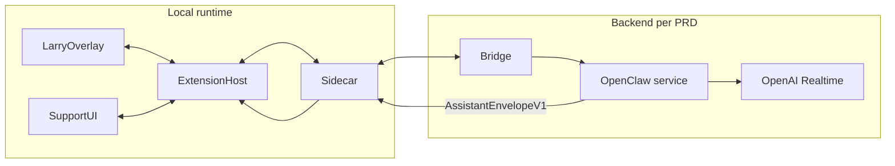

# Backend vs local runtime — responsibility split

This document prevents **misplaced implementation**: the **PRD “backend”** is not the same as “everything not in the web app.”

## Definitions

| Layer | Components | Owns |
|-------|------------|------|
| **Backend (PRD)** | **Go bridge** + **OpenClaw service** + **OpenAI Realtime integration** | Session orchestration, tools (`vscode_probe_state`, `cursorbuddy_emit_envelope`, ...), provider communication, policy, audit, upstream params. |
| **Local runtime** | Extension host, Larry overlay, minimal support UI, **sidecar** | Mic capture, encoding, TTS playback, client connection to the bridge, **Action Executor**, editor decorations, keybindings, overlay behavior in [`COMPANION_OVERLAY_UX_SPEC.md`](COMPANION_OVERLAY_UX_SPEC.md). |

## Data flow (high level)

## What goes where

| Concern | Backend (OpenClaw / bridge) | Local |
|--------|-------------------------------|--------|
| Speech-to-text / LLM **orchestration** | Yes (OpenClaw + OpenAI Realtime) | Sidecar **streams** audio/text to the bridge; does not replace reasoning. |
| Emitting **`assistant_text`** and **`actions`** | Yes (tool → validated envelope) | Executor runs actions after validation. |
| Larry overlay and **bubble / mini chat rendering** | No | Extension + local UI/sidecar receive text chunks from transport and render. |
| `Control+Option+L` / `Control+Option+V` / `Control+Option+C` controls | No | Extension + sidecar. |
| Session JWT / mTLS to org gateway | Bridge + OpenClaw | Sidecar presents tokens; extension secrets storage. |
| Allowlisted `executeCommand` | Contract in envelope | Extension maps alias → ID + validates. |

## STT and streaming UX

- **Where inference runs:** OpenClaw using OpenAI Realtime.
- **Where Larry's text, bubble, mini chat, and speaking state render:** Local runtime ([`docs/07_LOCAL_CURSOR_AND_COMPANION.md`](../../docs/07_LOCAL_CURSOR_AND_COMPANION.md)).
- **Where `assistant_text` is shown incrementally:** Local UI binds to incremental delivery from the bridge/OpenClaw transport.
- **Where TTS plays:** Local runtime / sidecar, driven by backend responses.

## Grounding “guide the user on screen”

v1 **does not** drive arbitrary OS‑wide mouse automation ([`docs/01_GENERAL_PRD.md`](../../docs/01_GENERAL_PRD.md)). “Guidance” means:

- **`AssistantEnvelopeV1`** with **`assistant_text`** (shown through Larry and support UI),
- **Actions**: `execute_command`, `reveal_uri`, `set_editor_selection`, decorations, etc. ([`docs/02_TECHNICAL_PRD.md`](../../docs/02_TECHNICAL_PRD.md) §4.3).

## Related

- [`AGENT_SYSTEM_INSTRUCTIONS.md`](AGENT_SYSTEM_INSTRUCTIONS.md)
- [`docs/03_BACKEND_PRD.md`](../../docs/03_BACKEND_PRD.md)
- [`docs/02_TECHNICAL_PRD.md`](../../docs/02_TECHNICAL_PRD.md) §1–4
