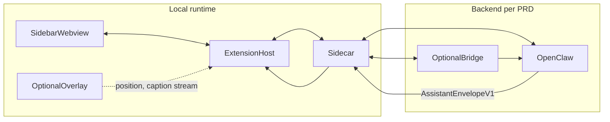

# Backend vs local runtime — responsibility split

This document prevents **misplaced implementation**: the **PRD “backend”** is not the same as “everything not in the web app.”

## Definitions

| Layer | Components | Owns |
|-------|------------|------|
| **Backend (PRD)** | **OpenClaw** (required) + **optional Go bridge** | Session orchestration, tools (`vscode_probe_state`, `cursorbuddy_emit_envelope`, …), model/realtime routing **inside** OpenClaw, policy, audit (bridge), minting upstream params ([`docs/openapi.yaml`](../../docs/openapi.yaml)). |
| **Local runtime** | Extension host, sidebar **webview**, **sidecar**, **optional overlay** process | Mic capture, encoding, WSS/HTTP client to OpenClaw (or bridge), **Action Executor**, editor decorations, keybindings, **pointer‑adjacent UI** spec in [`COMPANION_OVERLAY_UX_SPEC.md`](COMPANION_OVERLAY_UX_SPEC.md). |

## Data flow (high level)

## What goes where

| Concern | Backend (OpenClaw / bridge) | Local |
|--------|-------------------------------|--------|
| Speech‑to‑text / LLM **orchestration** | Yes (inside OpenClaw config) | Sidecar **streams** audio/text **to** OpenClaw; does not replace reasoning. |
| Emitting **`assistant_text`** and **`actions`** | Yes (tool → validated envelope) | Executor runs actions after validation. |
| **Cursor‑following pill** and **streaming caption** | No | Extension + overlay/sidecar receive text chunks from transport and render. |
| **Global chord** (e.g. ⌃⌥⌘) | No (OS registers shortcut) | Extension `keybindings` + sidecar if global hook needed per platform. |
| Session JWT / mTLS to org gateway | Bridge + OpenClaw | Sidecar presents tokens; extension secrets storage. |
| Allowlisted `executeCommand` | Contract in envelope | Extension maps alias → ID + validates. |

## STT and streaming UX

- **Where inference runs:** OpenClaw (and whatever realtime provider it configures).
- **Where the waveform / caption animates:** Local webview and/or overlay ([`docs/07_LOCAL_CURSOR_AND_COMPANION.md`](../../docs/07_LOCAL_CURSOR_AND_COMPANION.md)).
- **Where `assistant_text` is shown streaming:** Local UI binds to **incremental** delivery from the OpenClaw/sidecar transport; the bridge, if present, should be **transparent** to framing where possible ([`docs/03_BACKEND_PRD.md`](../../docs/03_BACKEND_PRD.md) §2).

## Grounding “guide the user on screen”

v1 **does not** drive arbitrary OS‑wide mouse automation ([`docs/01_GENERAL_PRD.md`](../../docs/01_GENERAL_PRD.md)). “Guidance” means:

- **`AssistantEnvelopeV1`** with **`assistant_text`** (shown in overlay + sidebar),
- **Actions**: `execute_command`, `reveal_uri`, `set_editor_selection`, decorations, etc. ([`docs/02_TECHNICAL_PRD.md`](../../docs/02_TECHNICAL_PRD.md) §4.3).

## Related

- [`AGENT_SYSTEM_INSTRUCTIONS.md`](AGENT_SYSTEM_INSTRUCTIONS.md)
- [`docs/03_BACKEND_PRD.md`](../../docs/03_BACKEND_PRD.md)
- [`docs/02_TECHNICAL_PRD.md`](../../docs/02_TECHNICAL_PRD.md) §1–4
